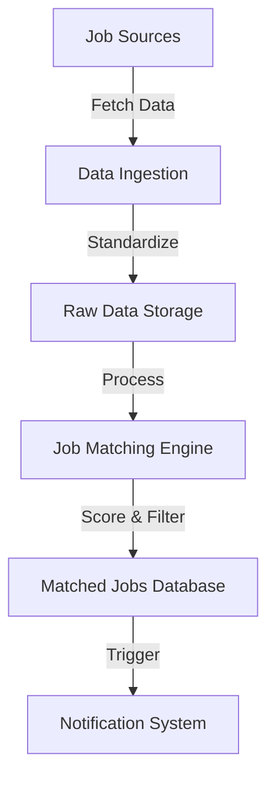

# Remote Job Search Data Pipeline Design

## 1. Overview
### Purpose
Design a comprehensive, automated data pipeline for aggregating, analyzing, and notifying about remote backend job opportunities that match specific professional preferences.

## 2. System Architecture
### High-Level Architecture
```
[Data Sources] --> [Data Ingestion] --> [Data Processing] --> [Analysis] --> [Notification Layer]
```

### Components
1. **Data Sources**
   - Job Boards APIs
   - Web Scraping Endpoints
   - Potential Sources:
     * RemoteOK
     * WeWorkRemotely
     * LinkedIn Jobs
     * Stack Overflow Jobs
     * GitHub Jobs

2. **Data Ingestion Layer**
   - Fetch job postings from multiple sources
   - Standardize job posting data format
   - Implement robust error handling
   - Support both API and web scraping methods

3. **Data Storage**
   - Raw Data Storage
     * JSON files for unprocessed job data
     * Preserve original job posting information
   - Processed Data Storage
     * Relational Database (SQLite/PostgreSQL)
     * Store analyzed and matched job postings

4. **Job Matching Engine**
   - Machine Learning/NLP-based matching
   - Configurable preference scoring
   - Multi-dimensional evaluation:
     * Technology stack match
     * Job type compatibility
     * Location preferences
     * Long-term job potential

5. **Notification System**
   - Multiple notification channels
     * Email
     * Telegram
     * Slack
     * Push notifications
   - Customizable alert thresholds

## 3. Workflow Detailed Design

### Data Collection Process


### Job Matching Algorithm
1. **Input Criteria**
   - Technology stack preferences
   - Job type (Full-time/Contract)
   - Geographic preferences
   - Compensation range
   - Company size/type

2. **Scoring Mechanism**
   - Weighted scoring system
   - Machine learning model training
   - Continuous learning from user interactions

3. **Matching Stages**
   - Initial keyword matching
   - Natural Language Processing analysis
   - Machine learning model scoring
   - Threshold-based filtering

## 4. Technology Stack
- **Programming Language**: Python
- **Data Processing**: 
  * Apache Airflow
  * Pandas
  * BeautifulSoup
- **Machine Learning**:
  * Scikit-learn
  * Hugging Face Transformers
  * OpenAI API
- **Database**:
  * SQLite/PostgreSQL
- **Notification**:
  * Telegram Bot API
  * SMTP for email
  * Slack Webhooks

## 5. Scalability & Performance Considerations
- Implement caching mechanisms
- Use asynchronous processing
- Rate limit API requests
- Implement circuit breakers
- Modular architecture for easy extension

## 6. Security & Compliance
- Secure API key management
- Data privacy protection
- Comply with job board terms of service
- Implement robust error handling
- Logging and monitoring

## 7. Future Enhancements
- User interaction feedback loop
- Advanced ML model training
- Support for more job sources
- Personalization algorithms
- Dashboard for job tracking

## 8. Deployment Strategy
- Containerization with Docker
- Kubernetes orchestration
- Cloud platform compatibility (AWS/GCP)
- CI/CD pipeline integration

## 9. Monitoring & Observability
- Logging mechanisms
- Performance metrics
- Error tracking
- Job processing analytics

## 10. Estimated Resource Requirements
- Compute: 2-4 CPU cores
- Memory: 8-16 GB RAM
- Storage: 50-100 GB (scalable)
- Network: Stable internet connection

## Conclusion
A flexible, intelligent job search pipeline that adapts to individual professional preferences while maintaining robust data collection and processing capabilities.
